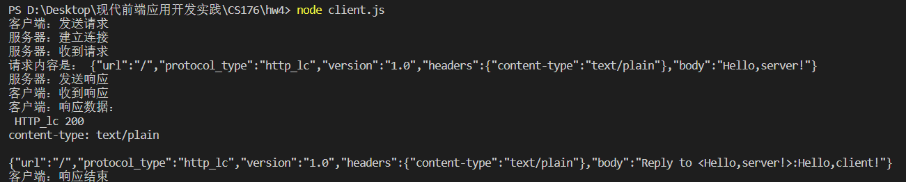
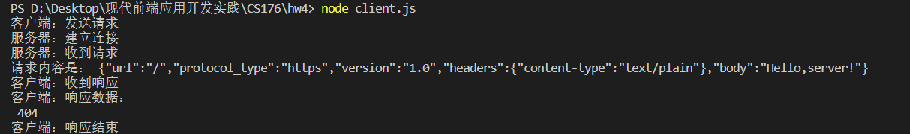

# A simple http protocol implemented by javascript with nodejs

## Get Started

```
cd hw4
```
In the terminal:

```
node client.js
```
## Demonstration

The client uses the protocol http_lc:


The client doesn't use the protocol http_lc:

